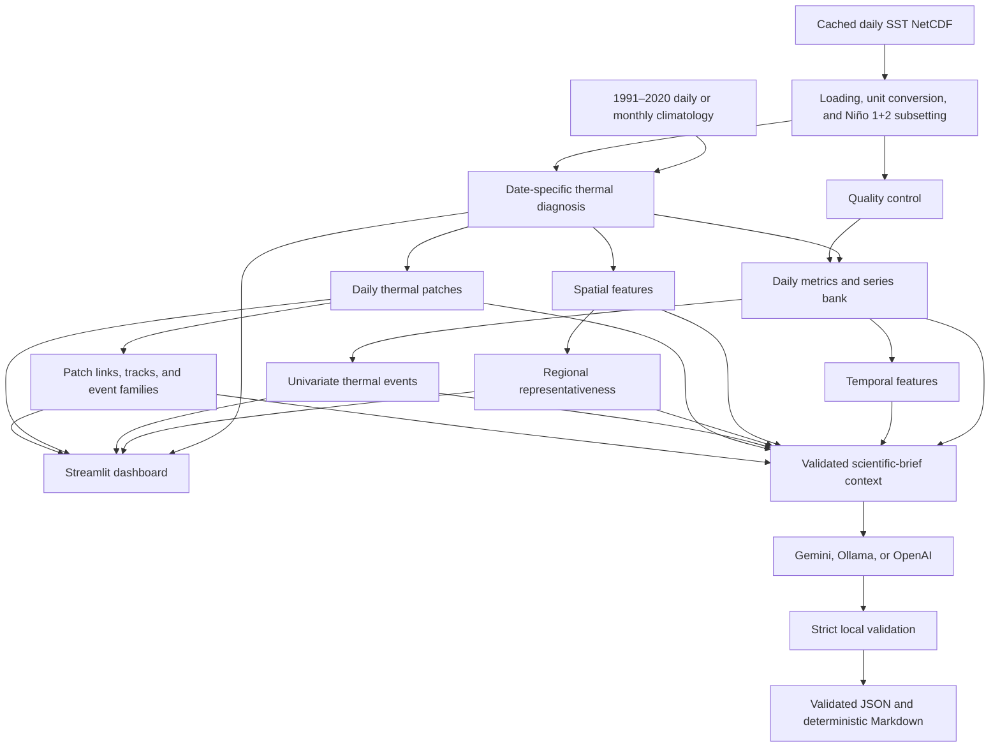

# Humboldt Ocean Watch

Humboldt Ocean Watch is an **experimental daily thermal-monitoring product** for
sea surface temperature (SST) and thermal anomalies in the Niño 1+2 region
(90–80°W, 10°S–0°). It combines cached gridded SST, a 1991–2020 smoothed daily
climatology, deterministic scientific analytics, an English-only
interpretability-first Streamlit dashboard, and an optional validated
scientific-brief pipeline.

This repository does **not** provide an official classification of Coastal El
Niño magnitude, causal attribution, forecasts, or biological, fisheries,
economic, or social impact assessments. It does not replace official
oceanographic products. Language models only interpret facts calculated and
validated locally by Python; they do not calculate the scientific metrics.

## Table of contents

- [Main capabilities](#main-capabilities)
- [Geographic foundation](#geographic-foundation)
- [System architecture](#system-architecture)
- [Repository structure](#repository-structure)
- [End-to-end workflow](#end-to-end-workflow)
- [Installation](#installation)
- [Quick start](#quick-start)
- [Full analytical pipeline](#full-analytical-pipeline)
- [Streamlit dashboard](#streamlit-dashboard)
- [Configuration](#configuration)
- [Input data](#input-data)
- [Outputs](#outputs)
- [Scientific brief architecture](#scientific-brief-architecture)
- [LLM providers](#llm-providers)
- [Generating a scientific brief](#generating-a-scientific-brief)
- [Validation and testing](#validation-and-testing)
- [Troubleshooting](#troubleshooting)
- [Scientific limitations](#scientific-limitations)
- [Development workflow](#development-workflow)
- [License](#license)

## Main capabilities

- Discovers cached live SST first and uses synthetic demonstration SST as a
  credential-free fallback.
- Recognizes multiple SST variable names, normalizes coordinates, subsets Niño
  1+2, and converts Kelvin to degrees Celsius.
- Uses a stable 366-bin calendar and a 1991–2020 daily climatology formed from a
  ±5-day sampling window and circular 31-day smoothing. The monthly climatology
  remains an explicitly labelled fallback.
- Calculates daily SST, anomaly, standardized anomaly, daily and seven-day
  changes, persistence, threshold areas, profiles, centroids, and regional
  cosine-latitude-weighted metrics.
- Produces a structured quality-control report and a long-format daily series
  bank with explicit result status.
- Extracts temporal state, magnitude, variability, instability, trend,
  persistence, and complexity features.
- Extracts spatial distribution, gradients, autocorrelation, patch, geometry,
  and threshold features.
- Classifies spatial representativeness without treating the classes as an
  ordinal severity scale.
- Detects calendar-aware univariate thermal events from compatible series.
- Identifies daily connected thermal patches using spherical cell areas.
- Links daily patches into non-branching tracks and lineage-connected event
  families while preserving split, merge, and complex relationships.
- Presents all cached products through one English interpretability-first
  interface, with technical detail available through progressive disclosure.
- Builds a provenance-aware scientific context and optionally generates
  bilingual scientific briefs through Gemini, Ollama, or OpenAI.
- Applies strict structural, linguistic, numerical, claim-grounding, mandatory
  fact-coverage, cross-language, and disclaimer validation before publication.

The implemented scope is thermal. Chlorophyll, currents, forecasts, and
climate-change attribution are intentionally outside the current project.

## Geographic foundation

Increment 6A adds a validated geographic registry without changing the active
scientific calculation domain. The foundation defines four geographic scopes:

- **Pacific context**: the display and future broad-analysis domain
  (170°W–70°W, 45°S–10°N).
- **Humboldt coastal system**: a future high-resolution analysis domain
  (85°W–70°W, 45°S–2°N).
- **South Pacific High diagnostic domain**: a diagnostic, not official,
  atmospheric domain (120°W–70°W, 45°S–15°S).
- **Niño 1+2**: the unchanged active scientific domain
  (90°W–80°W, 10°S–0°), retained in the legacy `region` block.

Niño 3.4, Niño 3, and Niño 1+2 are represented as deterministic
rectangles. A Humboldt coastal corridor is defined geodesically from 2°N to
45°S with a maximum offshore distance of 60 nautical miles (111.12 km),
measured only from the continental Pacific coastline of Ecuador, Peru, and
Chile. Islands, archipelagos, and islets are excluded as buffer sources. The
complete land geometry, including islands, remains an exclusion mask, so land
inside the mainland-derived corridor appears as a hole rather than extending
the corridor. The corridor is a diagnostic geographic definition, not a
political or official jurisdiction. It is generated only when complete local
coastline and land geometry are available; the application never downloads
Natural Earth automatically.

Generate the offline foundation preview with:

```powershell
uv run python scripts\preview_geographic_foundation.py `
  --config config.yaml `
  --output outputs\figures\geographic_foundation_preview.png `
  --overwrite
```

Current SST, climatology, event, patch, and track calculations remain
restricted to Niño 1+2. The planned sequence is:

1. Increment 6A — Geographic foundation
2. Increment 6B — English interpretability-first interface
3. Increment 6C — Multidomain SST
4. Increment 6D — Dynamic SST refresh
5. Increment 7A — South Pacific High
6. Increment 7B — Atmospheric climatology
7. Increment 8 — Ecosystem products
8. Increment 9 — Multivariate integration

## System architecture



Remote access is not part of normal dashboard execution. Cached SST and
analytical products are used locally. The climatology builders are explicit,
separate commands; the 30-year daily builder accesses Copernicus Marine only
when a user deliberately runs it. Provider preflights and real brief generation
are also explicit network operations.

## Repository structure

```text
humboldt-ocean-watch/
├── app.py                  # Streamlit entry point
├── config.yaml             # Scientific, interface, output, and provider settings
├── requirements.txt        # Pinned Python dependencies
├── .env.example            # Non-secret provider environment template
├── data/
│   ├── live/               # Cached Copernicus OSTIA NRT input
│   ├── demo/               # Synthetic SST fallback
│   ├── climatology/        # Daily/monthly reference products and checkpoints
│   └── processed/          # Snapshot and daily metric products
├── outputs/
│   ├── analytics/          # QC, features, events, patches, tracks, and families
│   ├── briefs/             # Validated context, brief JSON, metadata, and Markdown
│   ├── figures/            # PNG maps and validation figures
│   └── reports/            # JSON reports
├── scripts/                # Reproducible builders, validators, and provider checks
├── src/                    # Scientific, validation, provider, plotting, and UI modules
└── tests/                  # Deterministic offline unit and integration tests
```

### Scripts

| Script | Purpose |
| --- | --- |
| `generate_demo_data.py` | Creates the configured synthetic daily SST NetCDF file. |
| `build_climatology.py` | Builds the resumable monthly 1991–2020 OSTIA climatology year by year. |
| `build_daily_climatology.py` | Builds the stable-calendar, smoothed daily 1991–2020 climatology with validated yearly checkpoints. |
| `validate_daily_climatology.py` | Checks daily climatology structure, units, finite values, calendar mapping, percentiles, and temporal continuity; writes JSON and PNG validation products. |
| `build_daily_snapshot.py` | Loads live or demo SST, diagnoses the latest date, and writes the snapshot, metrics, and core figures. |
| `build_metrics.py` | Builds the operational date-by-date regional metrics table. |
| `build_series_bank.py` | Runs input QC and builds the long-format daily metric series bank. |
| `build_features.py` | Builds long-format temporal and spatial feature tables. |
| `build_representativeness.py` | Builds daily anomaly representativeness metrics and classes. |
| `build_univariate_events.py` | Detects configured time-series threshold events and writes event, flag, and summary products. |
| `build_daily_patches.py` | Identifies and characterizes date-local connected thermal patches. |
| `build_spatiotemporal_tracks.py` | Links cached daily patches into lineage edges, tracks, and event families. |
| `preview_geographic_foundation.py` | Validates and renders the offline multidomain geographic foundation without downloading coastlines. |
| `build_brief_context.py` | Assembles an offline, provenance-aware, validated context from cached analytical products. |
| `validate_brief_context.py` | Validates an existing context JSON without contacting a provider. |
| `check_llm_access.py` | Runs an explicit provider-neutral Gemini, Ollama, or OpenAI access preflight. |
| `check_openai_access.py` | Runs the legacy OpenAI-specific preflight entry point. |
| `generate_scientific_brief.py` | Validates context, previews requests, or generates validated bilingual briefs through the selected provider. |
| `validate_scientific_brief.py` | Revalidates one structured brief against its context without a provider call. |
| `render_scientific_brief.py` | Deterministically renders a schema-valid brief JSON to Markdown. |

Run `uv run python scripts\<name>.py --help` for the exact optional arguments
of scripts that use `argparse`. The three simple entry points
`generate_demo_data.py`, `build_daily_snapshot.py`, and `build_metrics.py` use
`config.yaml` directly and have no command-line options.

### Principal `src` modules

| Module group | Responsibilities |
| --- | --- |
| `data_loader.py`, `climatology.py`, `daily_climatology.py`, `daily_diagnosis.py`, `anomalies.py` | Input discovery, SST alias and unit normalization, stable-calendar climatology selection/matching, anomaly fields, and date-specific diagnoses. |
| `quality_control.py`, `metric_result.py`, `feature_metadata.py`, `series_bank.py` | Structural validation, weighted coverage, recoverable metric status, canonical metric metadata, and long-format daily series. |
| `temporal_metrics.py`, `temporal_features.py` | Operational daily metrics and date-aware rolling temporal features. |
| `spatial_metrics.py`, `spatial_features.py`, `spatial_adjacency.py`, `grid_geometry.py` | Area weighting, weighted statistics, gradients, Moran I, local variability, adjacency, spherical cell geometry, and daily patch descriptors. |
| `representativeness.py` | Deterministic daily spatial-representativeness metrics and nominal classes. |
| `event_thresholds.py`, `event_detection.py`, `event_metrics.py` | Explicit thresholds, calendar-aware univariate event detection, intensity, development, and severity metrics. |
| `patch_validation.py`, `patch_detection.py`, `patch_metrics.py` | Patch input validation, connected-component labelling, spherical area, intensity, geometry, and daily summaries. |
| `patch_linking.py`, `patch_tracking.py`, `track_validation.py`, `track_metrics.py` | Pairwise patch links, continuation backbone, lineage DAGs, track/family IDs, movement, area, and severity metrics. |
| `plotting.py`, `charting.py` | Robust fixed-domain Niño 1+2 maps and data-driven Altair/Matplotlib charts. |
| `event_data_loader.py`, `event_dashboard.py`, `event_charts.py`, `event_maps.py`, `event_tables.py`, `event_ui_utils.py` | Failure-tolerant loading and presentation of cached event, patch, track, and family products. No tracking is recalculated in Streamlit. |
| `i18n.py`, `help_content.py`, `sidebar_manual.py`, `interpretation_text.py` | English-only Streamlit guidance, progressive disclosure, deterministic neutral interpretation text, and retained bilingual label compatibility for scientific briefs. |
| `export_utils.py` | Safe recursive JSON conversion and output helpers that reject non-standard NaN/Infinity tokens. |
| `brief_context.py`, `brief_provenance.py`, `brief_fact_registry.py`, `brief_fact_coverage.py` | Offline context assembly, provenance, canonical facts, and mandatory operational-fact coverage planning. |
| `brief_schema.py`, `brief_output_schema.py`, `brief_prompt_contract.py`, `brief_prompts.py`, `brief_response_parser.py` | Versioned schemas, compact provider contracts, injection-resistant prompts, and structured response parsing. |
| `brief_validation.py`, `brief_claim_validation.py`, `brief_numeric_validation.py`, `brief_language_validation.py`, `brief_disclaimer.py` | Context/output schema validation, fact and numeric grounding, language safeguards, and the deterministic mandatory disclaimer. |
| `brief_generator.py`, `brief_generation_metadata.py`, `brief_renderer.py` | Provider-neutral generation orchestration, sanitized metadata/failure reporting, atomic publication, and deterministic Markdown rendering. |
| `llm_provider.py`, `gemini_client.py`, `ollama_client.py`, `openai_client.py`, provider preflight/schema modules | Provider settings and precedence, native clients, sanitized bounded failures, explicit preflights, and provider-specific schema adaptation. |

## End-to-end workflow

The normal local sequence is:

1. Place cached OSTIA SST in `data/live/nino12_sst_nrt.nc`, or generate the
   demo fallback.
2. Build the daily climatology once, or provide the already generated file in
   `data/climatology/`. Validate it before analytical use. A real monthly
   climatology may be used only as the explicit configured fallback.
3. Build the daily snapshot and regional metrics.
4. Run QC and create the series bank.
5. Build temporal/spatial features and representativeness.
6. Detect univariate events and daily patches.
7. Link daily patches into tracks and event families.
8. Build and validate the scientific-brief context from those cached products.
9. Inspect the dashboard locally.
10. Optionally run a provider preflight, dry-run, real generation, strict
    validation, and deterministic Markdown rendering.

Builders that publish analytical tables use local cached inputs and write
temporary files before replacing final products. Most refuse to overwrite an
existing output unless `--overwrite` is supplied.

## Installation

Use Python 3.12 and [`uv`](https://docs.astral.sh/uv/). This repository uses
`requirements.txt` as its installation contract; it does not use `uv sync` as
the primary workflow.

Windows PowerShell:

```powershell
cd D:\.apps\humboldt-ocean-watch
python -m venv .venv
uv pip install --python .venv\Scripts\python.exe -r requirements.txt
```

`uv run` discovers the project virtual environment for subsequent commands.
Cartopy is optional at runtime for map coastlines: the plotting code retains a
plain Matplotlib fallback if Cartopy or Natural Earth features are unavailable.

Copy `.env.example` to a local `.env` only if provider configuration is needed.
`.env` is ignored by Git and must never contain credentials intended for
version control.

## Quick start

The credential-free demonstration path is:

```powershell
uv run python scripts\generate_demo_data.py
uv run python scripts\build_daily_snapshot.py
uv run streamlit run app.py
```

Streamlit normally opens `http://localhost:8501`. If the browser does not open,
navigate to that address manually. Stop the server with `Ctrl+C`.

The loader gives priority to `data/live/nino12_sst_nrt.nc`. If that file is
absent, it uses `data/demo/synthetic_sst_daily.nc`; if necessary, the demo can
be generated without Copernicus credentials. The interface always labels the
active data mode.

## Full analytical pipeline

The following PowerShell commands reflect the current script interfaces. Run
them from the repository root.

### 1. Climatology

The full daily builder is resumable and requests one reference year at a time.
It is the only command in this sequence that intentionally accesses
Copernicus Marine. It is not run by the app or test suite.

```powershell
uv run python scripts\build_daily_climatology.py `
  --start-year 1991 `
  --end-year 2020 `
  --output data\climatology\nino12_daily_climatology_1991_2020.nc `
  --checkpoint-dir data\climatology\checkpoints_1991_2020 `
  --sampling-half-window-days 5 `
  --smoothing-window-days 31 `
  --resume

uv run python scripts\validate_daily_climatology.py `
  --input data\climatology\nino12_daily_climatology_1991_2020.nc
```

For the explicit monthly fallback/sensitivity product:

```powershell
uv run python scripts\build_climatology.py `
  --start-year 1991 `
  --end-year 2020 `
  --output data\climatology\nino12_monthly_climatology_1991_2020.nc
```

Daily and monthly baselines are never silently mixed. Real SST is never paired
with a synthetic climatology.

### 2. Diagnosis, metrics, and QC

```powershell
uv run python scripts\build_daily_snapshot.py
uv run python scripts\build_metrics.py
uv run python scripts\build_series_bank.py --overwrite
```

`build_series_bank.py` writes both
`outputs/analytics/daily_series_bank.parquet` and
`outputs/analytics/qc_report.json`.

### 3. Features and representativeness

```powershell
uv run python scripts\build_features.py --overwrite
uv run python scripts\build_representativeness.py --overwrite
```

### 4. Events, patches, tracks, and families

```powershell
uv run python scripts\build_univariate_events.py --overwrite
uv run python scripts\build_daily_patches.py --overwrite
uv run python scripts\build_spatiotemporal_tracks.py --overwrite
```

Daily patch IDs are local to one date. `track_id` identifies a maximal
non-branching segment, while `event_family_id` identifies all observations
connected through continuation, split, merge, or complex lineage edges.

### 5. Scientific context

```powershell
uv run python scripts\build_brief_context.py `
  --analysis-date latest `
  --strict `
  --overwrite

uv run python scripts\validate_brief_context.py `
  --input outputs\briefs\brief_context_latest.json `
  --strict
```

This context build is entirely offline. It reads the cached JSON and Parquet
products configured under `brief_context` and does not open large NetCDF cubes
or rerun scientific calculations.

## Streamlit dashboard

Launch the application with:

```powershell
uv run streamlit run app.py
```

`app.py` coordinates reusable loading, calculation, charting, event-dashboard,
help, and export modules. Its main tabs are:

- **Overview** — selected date, concise thermal status, primary regional
  metrics, active data/climatology mode, and representativeness summary.
- **Maps** — fixed-domain SST, anomaly, z-score, daily change, and persistence
  maps with stable cross-date color limits.
- **Time series** — regional SST, anomaly, threshold-area, distribution, and
  centroid series with data-driven temporal axes.
- **Spatial behaviour** — persistence, centroid trajectory, and separate
  latitude/longitude anomaly profiles.
- **Quality and representativeness** — QC status, representativeness class,
  evidence metrics, trends, and analytical downloads.
- **Thermal events** — event overview plus sub-tabs for daily patches, tracks
  and trajectories, and event families/lineage, all loaded from cached
  Increment 4 products.
- **Data and methods** — active source, climatology method and parameters,
  tracking definitions, bilingual glossary, warnings, and limitations.
- **Export** — diagnosis and cached product downloads using safe JSON/CSV
  serialization.

The Streamlit interface is English-only and has one
`interpretability_first` presentation mode. The sidebar exposes only dates
available in the active SST cube plus the temporal period, anomaly threshold,
and persistence window. Results and neutral interpretation appear first;
supporting diagnostics, methods, internal identifiers, large catalogues, and
lineage details remain available in clearly labelled expanders. This
progressive disclosure changes presentation only, never calculations or data
filters. Scientific briefs remain independently available in Spanish and
English through the CLI (`--language es`, `--language en`, or `--language both`).

The active SST calculation domain remains Niño 1+2. The Geographic Foundation
defines overlays and future analysis domains only; multidomain SST and dynamic
data refresh are not yet implemented.

Cached Copernicus and synthetic modes are labelled explicitly. With real SST,
the climatology priority is daily smoothed, then the explicit real monthly
fallback. When no compatible real climatology exists, SST and daily change
remain available while anomaly-dependent products are disabled with a warning.

## Configuration

`config.yaml` is the single project configuration file. Its blocks control:

| Block | Controls |
| --- | --- |
| `project` | Public name and experimental-product label. |
| `region` | Fixed Niño 1+2 longitude and latitude bounds. |
| `geography` | Future display/analysis domains, standard Niño rectangles, the 60 nm coastal corridor, and map overlays. |
| `data` | Live/demo input priority, processed paths, SST aliases, and demo seed/length. |
| `outputs` | Core map and daily diagnosis report paths. |
| `logging` | Application and builder log level. |
| `interface` | Fixed English language, interpretability-first mode, progressive disclosure, hidden primary-view IDs, and disabled language/mode selectors. |
| `climatology` | Primary/fallback method, 1991–2020 reference years, sampling/smoothing windows, file paths, and fallback safeguards. |
| `quality_control` | Frequency, duplicate/gap policy, coverage and observation minima, unit handling, and report path. |
| `series_bank` | Variables, warm-anomaly threshold, and long-format output. |
| `temporal_features` | Rolling windows and eligibility thresholds for temporal features. |
| `spatial_features` | Threshold, coverage, connectivity, patch size, Moran weights, and local window. |
| `representativeness` | Coverage, signal, coherence, heterogeneity, patch, coexistence, and numerical-stability thresholds. |
| `event_detection` | Source series, direction, threshold method, duration/interruption/gap rules, coverage, severity bands, and outputs. |
| `patch_detection` | Source field, direction, threshold, comparison, connectivity, filtering, compression, and outputs. |
| `patch_tracking` | Temporal gaps, overlap/distance candidates, deterministic link score, continuation backbone, compression, and outputs. |
| `event_dashboard` | Table/lineage limits, trajectory arrows, and map-layer defaults. |
| `brief_context` | Context schema, cached source paths, strictness, payload limit, fact windows, and provenance options. |
| `brief_generation` | Provider default and per-provider model/transport settings, language, repair policy, strict validation, output paths, and prohibited claims. |

Provider selection follows this precedence:

```text
explicit CLI option > environment variable > config.yaml > internal default
```

Once settings are resolved, provider clients and preflights use that immutable
settings object rather than silently resolving the environment again.

## Input data

The expected input is a NetCDF `xarray.Dataset` with:

- a readable `time` coordinate;
- one-dimensional `latitude`/`lat` and `longitude`/`lon` coordinates;
- a numeric SST field named `analysed_sst`, `sst`, `thetao`, or
  `sea_surface_temperature`;
- units recognizable as Kelvin or Celsius.

The loader sorts/safely subsets ascending or descending latitude and supports
longitudes in either −180–180 or 0–360 form. It subsets longitude −90 to −80
and latitude −10 to 0. Kelvin is detected from metadata and/or defensible value
validation and converted to degrees Celsius once; existing Celsius data is not
converted again. Dates always come from the time coordinate, not global
coverage attributes.

Input priority:

1. `data/live/nino12_sst_nrt.nc` — cached Copernicus OSTIA NRT SST.
2. `data/demo/synthetic_sst_daily.nc` — deterministic synthetic fallback.

The application and local analytical builders do not require internet access.
Only the explicit climatology builders need Copernicus Marine access when new
reference data must be downloaded.

## Outputs

### `data/processed`

- `daily_snapshot.nc` — selected-date diagnosis fields.
- `nino12_daily_metrics.parquet` — one regional metrics row per available SST
  date.

### `outputs/analytics`

- `qc_report.json` and `daily_series_bank.parquet`.
- `temporal_features.parquet`, `spatial_features.parquet`, and
  `representativeness.parquet`.
- `univariate_events.parquet`, `univariate_event_daily_flags.parquet`, and
  `univariate_event_summary.json`.
- `daily_patches.parquet`, `daily_patch_summary.parquet`,
  `daily_patch_labels.nc`, and `daily_patch_build_summary.json`.
- `spatiotemporal_patch_observations.parquet`, `patch_lineage_edges.parquet`,
  `spatiotemporal_tracks.parquet`, and
  `spatiotemporal_event_families.parquet`.
- `spatiotemporal_track_labels.nc`, `track_id_mapping.parquet`,
  `event_family_id_mapping.parquet`, and
  `spatiotemporal_tracking_summary.json`.

Parquet stores long/tabular analytics, NetCDF stores georeferenced label cubes,
and JSON stores QC/build summaries and safe metadata.

### `outputs/figures` and `outputs/reports`

PNG products include current SST, anomaly, z-score, and climatology continuity
figures. JSON reports include the selected daily metrics and climatology
validation report.

### `outputs/briefs`

The public brief products include dated/latest context JSON, fact-registry
Parquet, context validation JSON, language-specific validated brief JSON,
deterministic Markdown, generation metadata, validation reports, optional
cross-language validation, and the generation summary. Partial invalid model
responses are never published as final artifacts.

Generated data and outputs are ignored by Git except for intentional placeholder
files. Review product size and sensitivity before sharing any artifact.

## Scientific brief architecture

The scientific-brief pipeline is deliberately asymmetric: Python owns facts
and validation; the selected model only composes constrained prose.

1. `build_brief_context.py` reads cached analytical products for one resolved
   analysis date.
2. Python creates stable fact identifiers, values, units, status, provenance,
   and a compact mandatory operational-fact coverage plan.
3. `validate_brief_context.py` enforces the context schema, payload limits,
   cross-product consistency, dates, coverage, provenance, and facts.
4. The prompt contains only the validated context, strict response contract,
   permitted fact IDs, prohibited claims, and language requirements. The model
   does not calculate metrics and must not introduce unsupported numbers.
5. The provider returns exactly one JSON object. Provider schema adapters may
   reduce unsupported grammar features, but the complete local schema remains
   authoritative.
6. Python inserts the mandatory experimental-product disclaimer
   deterministically; it is not delegated to the model.
7. Output validation checks the full schema, requested language, word limits,
   prohibited claims, cited fact IDs, mandatory operational coverage, all
   numerical tokens against the fact registry, and claim support.
8. When both languages are requested, a deterministic cross-language check is
   also required.
9. At most one **scientific repair** request is allowed for a failed model
   output. Provider transport retries are separately bounded and do not consume
   that repair allowance.
10. There is no silent fallback between Gemini, Ollama, and OpenAI. A provider
    failure remains a failure for the selected provider.
11. Atomic publication preserves previous valid files when generation or
    validation fails. Sanitized diagnostics omit prompts, context, environment,
    credentials, and raw provider output.
12. Valid structured JSON is rendered to Markdown deterministically by Python.

The generated prose is still experimental and must be reviewed by a qualified
human before external use.

## LLM providers

All providers use temperature zero, no tools, no web search, no external
grounding, and strict local validation. Model availability and provider terms
can change, so always run the explicit preflight before real generation.

| Provider | Maintained default | Interface and behavior |
| --- | --- | --- |
| Gemini | `gemini-3.1-flash-lite` | Native `google-genai` client; API key in `GEMINI_API_KEY`; JSON response mode; automatic function calling, tools, search grounding, and thoughts disabled; bounded transient transport retries. |
| Ollama | `qwen3:4b` | Native local `ollama` client at `http://localhost:11434`; no API key; JSON mode by default; `think=False`; 65,536-token configured context; no provider fallback. |
| OpenAI | `gpt-5.6` | Official Responses API client; API key in `OPENAI_API_KEY`; medium reasoning effort and text verbosity by default; structured output and strict local validation. |

`gemini-3.1-flash-lite` is the repository's maintained operational example
because it is the model used by the validated local development configuration.
It may still be overridden with `--model` or `GEMINI_MODEL`. The code does not
claim that any provider is free or unlimited.

Never submit confidential, restricted, personal, or otherwise unauthorized
institutional information to an external provider. Keep API keys out of files,
logs, screenshots, issues, commits, and generated reports.

## Generating a scientific brief

The commands below distinguish offline validation from operations that contact
a provider.

### 1. Build and validate the context (offline)

```powershell
uv run python scripts\build_brief_context.py `
  --analysis-date latest `
  --strict `
  --overwrite

uv run python scripts\validate_brief_context.py `
  --input outputs\briefs\brief_context_latest.json `
  --strict
```

### 2. Configure a provider without committing secrets

Gemini example consistent with the maintained defaults:

```powershell
$env:GEMINI_API_KEY="your-key"
$env:LLM_PROVIDER="gemini"
$env:GEMINI_MODEL="gemini-3.1-flash-lite"
$env:GEMINI_STRUCTURED_OUTPUT_MODE="json"
$env:GEMINI_MAXIMUM_OUTPUT_TOKENS="3500"
```

Ollama example:

```powershell
$env:LLM_PROVIDER="ollama"
$env:OLLAMA_MODEL="qwen3:4b"
$env:OLLAMA_BASE_URL="http://localhost:11434"
$env:OLLAMA_NUM_CTX="65536"
$env:OLLAMA_STRUCTURED_OUTPUT_MODE="json"
```

OpenAI example:

```powershell
$env:OPENAI_API_KEY="your-key"
$env:LLM_PROVIDER="openai"
$env:OPENAI_MODEL="gpt-5.6"
```

### 3. Run the explicit access preflight (contacts the selected provider)

```powershell
uv run python scripts\check_llm_access.py `
  --provider gemini `
  --model gemini-3.1-flash-lite
```

The Gemini and Ollama preflights make small capability requests but do not send
the scientific context. OpenAI can also be checked through the provider-neutral
command or `scripts\check_openai_access.py`.

### 4. Inspect the request with a dry-run (no provider call)

```powershell
uv run python scripts\generate_scientific_brief.py `
  --provider gemini `
  --model gemini-3.1-flash-lite `
  --context outputs\briefs\brief_context_latest.json `
  --language es `
  --dry-run `
  --overwrite
```

The preview reports provider/model selection, context and schema sizes,
structured-output mode, mandatory coverage, timeout, and retry configuration.

### 5. Generate a real brief (contacts the selected provider)

```powershell
uv run python scripts\generate_scientific_brief.py `
  --provider gemini `
  --model gemini-3.1-flash-lite `
  --context outputs\briefs\brief_context_latest.json `
  --language both `
  --overwrite
```

`--language` accepts `es`, `en`, or `both`. `--no-repair` disables the one
allowed scientific repair. `--validate-only` validates the context and exits
without contacting a provider.

### 6. Revalidate and render an existing structured brief (offline)

Replace the date placeholder with the brief's actual analysis date:

```powershell
uv run python scripts\validate_scientific_brief.py `
  --brief outputs\briefs\scientific_brief_YYYY-MM-DD_es.json `
  --context outputs\briefs\brief_context_latest.json `
  --language es `
  --strict

uv run python scripts\render_scientific_brief.py `
  --brief-json outputs\briefs\scientific_brief_YYYY-MM-DD_es.json `
  --output outputs\briefs\scientific_brief_YYYY-MM-DD_es.md `
  --overwrite
```

The generator already writes validated Markdown; the standalone renderer is
useful for deterministic regeneration from an existing valid JSON document.

## Validation and testing

Run the complete deterministic suite offline:

```powershell
uv run pytest -q
uv run python -m compileall app.py scripts src
```

The tests cover:

- SST loading, aliases, coordinate conventions, unit conversion, climatology,
  and date matching;
- quality control, coverage, weights, series-bank schemas, and safe JSON;
- temporal and spatial statistics, adjacency, gradients, profiles, plotting,
  and representativeness;
- univariate events, daily patch geometry, linking, lineage DAGs, tracks,
  families, and cached dashboard presentation;
- English Streamlit interface contracts, contextual help, deterministic
  interpretation text, legacy session-state migration, and progressive
  disclosure;
- brief-context and output schemas, provenance, mandatory fact coverage,
  disclaimer insertion, language and cross-language rules;
- numerical grounding, claim validation, repair diagnostics, atomic output
  preservation, rendering, and provider clients/preflights using mocks.

Tests never require a real Gemini, Ollama, OpenAI, or Copernicus call. Known
deprecation warnings from xarray/NumPy and Cartopy/Matplotlib may remain; any
`FAILED` result is a release blocker.

For climatology structure and continuity, also run:

```powershell
uv run python scripts\validate_daily_climatology.py `
  --input data\climatology\nino12_daily_climatology_1991_2020.nc
```

For a context or brief, use the dedicated validator commands shown above.

## Troubleshooting

### Streamlit does not open automatically

Open `http://localhost:8501` manually. Confirm the terminal still shows a
running Streamlit server.

### Port 8501 is occupied

Select another port:

```powershell
uv run streamlit run app.py --server.port 8502
```

### The cached live file is missing or demo mode appears

Confirm `data\live\nino12_sst_nrt.nc` exists. Otherwise the expected behavior
is to use or generate `data\demo\synthetic_sst_daily.nc`, with an explicit
Synthetic demonstration data label.

### Climatology products are unavailable

Check the configured paths under `climatology`. With real SST, synthetic
climatology is prohibited. An explicit real monthly fallback may be used if
enabled; otherwise anomaly and z-score products remain unavailable while SST
and daily change continue to work.

### A dependency is missing

Reinstall the pinned environment:

```powershell
uv pip install --python .venv\Scripts\python.exe -r requirements.txt
```

### `GEMINI_API_KEY` is not configured

Set it only in the current process or a local ignored `.env`; never add it to
Git. Run the Gemini preflight before real generation.

### Ollama is not running or the model is absent

Start the local Ollama service and verify that `qwen3:4b` is installed with
`ollama list`. The project never falls back silently to an external provider.

### Provider quota, timeout, or HTTP 503

Transient Gemini transport failures are retried with the bounded values in
`brief_generation.providers.gemini`. Quota, model-access, authentication,
context-length, and non-transient failures remain explicit and non-zero. Retry
later or choose a provider explicitly; do not expect automatic provider
switching.

### Scientific brief validation fails

Inspect the sanitized validation report and issue codes. Correct the context or
provider output and rerun. The generator permits at most one scientific repair
and preserves previous valid final artifacts. It does not publish a failed
partial result.

### Debug diagnostics

Dry-run and failure diagnostics are sanitized and stored only in the configured,
Git-ignored diagnostic location. Treat them as local troubleshooting material,
review them for sensitivity, and do not publish or commit them.

### `uv` warns about hardlinks on Windows

This normally indicates that the cache and environment are on filesystems that
cannot share hardlinks. `uv` can copy files instead; the warning is not a
scientific error.

### LF/CRLF differences appear

Use the repository's Git settings consistently and inspect `git diff --check`.
Do not normalize the entire repository as part of an unrelated change.

## Scientific limitations

- The product is experimental and limited to SST and derived thermal
  indicators in Niño 1+2.
- Results depend on source-data quality, valid-area coverage, spatial
  resolution, climatology selection, sampling/smoothing windows, thresholds,
  and patch connectivity.
- The 1991–2020 daily climatology is a reference baseline, not a forecast.
- Monthly fallback changes the temporal baseline and is always labelled; it is
  not silently mixed with the daily baseline.
- Representativeness classes describe whether a regional mean summarizes the
  spatial field. They are nominal classes, not severity levels, and their
  evidence score is not a probability.
- Daily patch IDs have no temporal meaning. Tracks are maximal non-branching
  linked segments; event families can include split and merge relationships.
- Thermal tracks describe evolving threshold regions, not individual water
  parcels or water masses. Boundary-touching tracks may be incomplete.
- Univariate regional events are not necessarily identical to spatial patches,
  tracks, or event families.
- No official Coastal El Niño magnitude is assigned.
- The project makes no causal attribution, climate-change attribution,
  forecast, or biological, fisheries, ecosystem, economic, or social impact
  claim.
- Generated prose is constrained and validated but still requires qualified
  human review.

## Development workflow

The canonical development branch is `main`:

```powershell
git switch main
git pull --ff-only origin main
git status
uv run pytest -q
git add README.md config.yaml
git commit -m "docs: concise description"
git push origin main
```

Stage only files deliberately changed for the task. Avoid `git add -A` when
generated products, data, diagnostics, or credentials may be present. Before a
commit, inspect `git diff --cached --stat`, `git diff --cached --check`, and
`git diff --cached --name-only`. Never commit `.env`, API keys, tokens,
`__pycache__`, `*.pyc`, temporary files, or local provider diagnostics.

## License

Humboldt Ocean Watch is distributed under the [MIT License](LICENSE).
